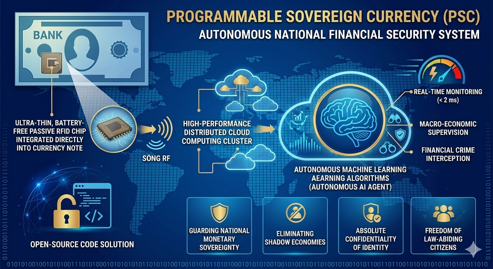

# Architectural System Flow Architecture Diagram

Below is the conceptual blueprint of the Programmable Sovereign Currency ecosystem, showcasing the end-to-end telemetry loop from physical banknote excitation to autonomous cloud cloud mitigation.



The system operates as an event-driven, micro-second pipeline broken down into three distinct processing planes:

```text
  [ PHYSICAL PLANE: HARDWARE ]
  Banknotes with ultra-thin Passive RFID Chips (Dynamic Token Obfuscation)
               │
               ▼ (UHF Radio Waves / 15m Range)
  [ EDGE PLANE: HARDWARE INGESTION ]
  Commercial POS Terminal Scanner / Airport Border Gate Scanner
               │
               ▼ (Asynchronous JSON Packet Serialization via 5G VPN Network)
  [ CLOUD PLANE: SOVEREIGN DATACENTER ]
  ┌────────────────────────────────────────────────────────────────────────┐
  │                                                                        │
  │     Apache Kafka Cluster (High-Throughput Queue Pipeline)              │
  │                         │                                              │
  │                         ▼ (Real-time Stream Ingestion)                 │
  │     Autonomous Financial AI Agent (Scikit-Learn Inference Engine)      │
  │            ├── Valid Consumer Behavior -> APPROVED                     │
  │            └── Threat Pattern Found ----> LOCK GEOFENCE / CH chặn      │
  │                         │                                              │
  │                         ▼ (Parallel Execution Under 2 Milliseconds)    │
  │     ScyllaDB Decentralized Ledger State Engine (Distributed Shards)    │
  │                                                                        │
  └────────────────────────────────────────────────────────────────────────┘
```

## Protocol Specifications
1. **Network Layer:** Encrypted TLS 1.3 protocol encapsulating custom binary packets over secure 5G slices.
2. **Database Schema:** Wide-column keyspaces sharded horizontally across localized geographical boundaries to ensure linear compute performance scaling.
